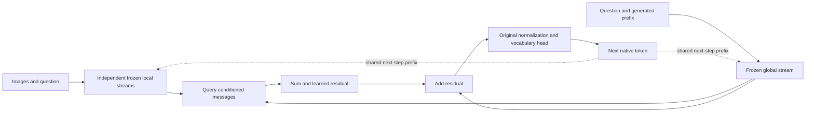

# Native aggregation: the current research claim

The objective is to improve how much evidence a model can combine at each generated query, so that the same operation can also help later reasoning tokens. The current evidence supports a substantial improvement from a training objective on MMReD Vision. It does not yet support reliable 64-frame performance, unseen-value extrapolation, or a benefit during free reasoning.

The simplest defensible question is: **can training on answer-preserving changes to an evidence set improve native aggregation at greater lengths, without adding inference steps?** This is narrower and more testable than claiming a new attention mechanism or an increase in intrinsic information capacity.

## The method and the matched comparison

Each image and the question pass through a complete frozen local model stream. A text-only global stream supplies the current query. A small query-conditioned module computes local messages, sums them, and adds a learned residual before the model's original final normalization and vocabulary head. The model emits its own output tokens. Subsequent generated tokens become the shared prefix of all streams.

This uses one batched model invocation per output token, with N+1 streams and their caches. That batching does not make its work equal to a conventional joint prompt. Independent evidence processing and generative fusion have close precedents in [FiD](https://aclanthology.org/2021.eacl-main.74/), while learned hierarchical reads are central to [HiLS](https://arxiv.org/abs/2607.02980). The architecture supplies an experimental setting; those ingredients do not establish novelty.

The cleanest completed intervention is V8. Equal-question, equal-answer scenes at N8 and N16 are encouraged to produce the same native residual, separately at each supervised output prefix. Both conditions use identical paired scenes, initialization within seed, training updates, architecture and inference. The treatment adds residual consistency to native answer cross-entropy. This comparison therefore isolates a training-objective effect much more closely than the earlier parallel-versus-joint architecture comparison.

## What is established

V8 increased familiar-count N32/N64 accuracy by 46.76 and 43.52 percentage points in two matched seeds. Its N32 accuracy was 108/108 in both seeds, and N64 was 72/108 and 53/108. Both relative criteria passed; both practical criteria failed at N64. Unseen K9–16 remained 0/128 in every model. All native output and selected-checkpoint checks completed, with the previously declared descriptive cache differences retained. [Verified V8 evidence](NATIVE_AGGREGATION_VISION_V8_RESULTS.md)

A read-only audit of the unseen-count traces found that both consistency models output8 on every unseen example. All first tokens were already wrong, so premature stopping after a correct first digit does not explain these recorded failures. This output saturation does not identify whether the hidden state retains larger-count information.

The remaining error is not entirely a new-image problem: the selected models still fail on larger synthetic sums constructed from fixed training-state prototypes. That diagnostic is outside the actual generator law and cannot replace held-out image evaluation. It supports testing the fusion/readout behavior directly.

V9 tests one explanation. Endpoint residual agreement can hide nonlinear cancellation and does not constrain extrapolation. Its training-only path penalty bounds changes in the residual along observed equal-answer evidence directions at every base point. It leaves deployed inference unchanged. This is a known directional-invariance and sensitivity-bound family, not a new inequality. The completed V9 test found that it worsens N64 performance in both seeds (18/108 versus47/108 and50/108); equal coefficients also do not imply equal regularization strength. [Registered V9 method and limits](NATIVE_AGGREGATION_PATH_BOUND.md)

V10 supplied every tested answer value0–16 during adaptation. Both consistency seeds again beat CE, but N64 accuracy was only20/136 and19/136; allK9–16 answers remained wrong at bothN32/N64 despite perfect64/64 selected N16 development. Both practical criteria failed. This establishes a length-generalization failure with supported answers; crosscampaign differences also changed the data/pairing law and cannot isolate answer coverage as a causal factor. [Verified V10 evidence](NATIVE_AGGREGATION_VISION_V10_RESULTS.md)

## What would make the result more general

Separate three axes that the present benchmark partly mixes:

1. **More evidence with supported answers.** V10 trains all native answer sequences for K0–16 with maximum scene lengthN16, then tests fresh N32/N64 scenes with that same K support. Low counts have N8/N16 pairs; higher counts use N16 pairs, with an explicit saturatedK16 exception. This removes unfamiliar answer continuations from the length comparison. The separate preregistration fixes the matched experiment and new feature-cache checks.
2. **Answers absent from adaptation.** Hold out interior single-digit values, such as odd counts, from training and development. Success would demonstrate numerical interpolation beyond trained answer classes. Failure would still not prove that count information is absent from the hidden state. K9 and multi-digit K10–16 should remain separate descriptive endpoints.
3. **Use during free reasoning.** Cross a validated treatment and matched control with direct and free-reasoning output policies within the same reasoning backbone. Reuse the aggregation operation at every naturally generated query. Short streaming execution checks already pass, but long-run cost, appropriate training-prefix coverage and efficacy remain untested. The current global stream is text-only: disabling its aggregation branch also removes its visual access. An answer-phase-only treatment on that layout would compare against scene-blind earlier reasoning. A valid free-reasoning control must preserve visual access, and a hybrid joint-image global stream needs new packing and resource validation. Teacher-forced final-answer CE also gives no gradient to earlier branch outputs when the token prefix is fixed. These are experimental-design constraints, not evidence of a reasoning benefit. A separate [reasoning experiment memo](NATIVE_AGGREGATION_REASONING_NEXT_EXPERIMENT.md) distinguishes fixed-prefix diagnostics from valid online comparisons.

Only ordinary native answer supervision is needed for the first two proposals. An external tally, local binary oracle or test-fitted output calibration would answer a different question. New visual primitives or another aggregation task are also needed before arguing broad task transfer.

V9 failed, so V8 residual consistency remains the supported intervention. The V10 experiment expands supervised answers to K0–16 while retaining max trainingN16 and testN64; it does not retain the path penalty. The completed matched experiment passed its relative criterion but failed practical accuracy in both seeds. The next [software proposal](NATIVE_AGGREGATION_MEMORY_WRITE_DESIGN.md) holds read features and pooling fixed while moving the write before the last transformer block, testing whether aggregation can enter native attention memory and receive later-token gradient credit. No efficacy or causal explanation is assumed. Adding penalties until a test score improves would not establish the proposed mechanism. A paper should lead with one supported intervention, explain its boundary, and treat broader aggregation and reasoning claims as requirements to test.

This working story supersedes the native-method interpretation of the older bind-then-count outline. Historical external-verdict/tally results remain valid for their own pipeline and are not native-method results.
